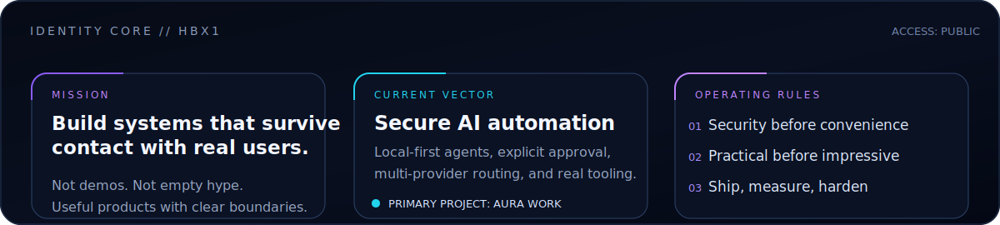
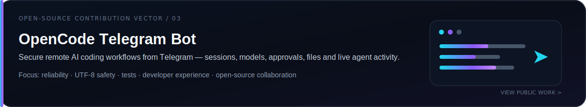
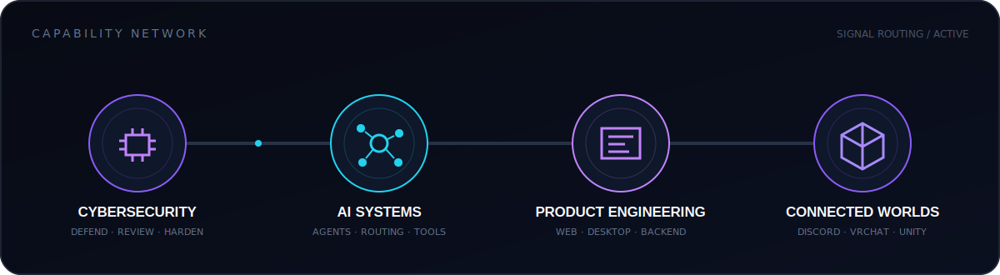

 

**I build real systems for real users — with security treated as part of the product, not an afterthought.**

Cybersecurity · AI Agents · Full-Stack Systems · Discord × VRChat · Open Source

 

 

## `// ACTIVE SYSTEMS`

<table>
  <tr>
    <td width="50%">
      
    </td>
    <td width="50%">
      
    </td>
  </tr>
</table>

 

## `// CAPABILITY NETWORK`

 

## `// FIELD LOG`

| Vector | What I actually build |
|---|---|
| **Secure AI agents** | Local-first automation, provider routing, approval gates, encrypted configuration, and developer tooling. |
| **Product systems** | Full-stack web platforms, desktop applications, APIs, dashboards, billing, and operational workflows. |
| **Connected communities** | Discord bots, VRChat/Udon integrations, allowlists, moderation systems, and persistent player experiences. |
| **Open source** | Practical fixes, tests, documentation, security hardening, and contributor-ready project structure. |

 

<strong>Open toolchain manifest</strong>

 

  

`TypeScript` · `JavaScript` · `Python` · `Rust` · `C#` · `React` · `Next.js` · `Node.js`  
`Tauri` · `PostgreSQL` · `SQLite` · `Unity` · `UdonSharp` · `GitHub Actions` · `Linux`

 

 

## `// PUBLIC REPOSITORIES`

- **[Aura Work](https://github.com/hbx12/aura-work)** — open-source, multi-provider desktop AI agent platform with a security-first architecture.
- **[NovirLink VRChat](https://github.com/hbx12/novirlink-vrchat)** — public Udon integration for the NovirLink platform.
- **[OpenCode Telegram Bot](https://github.com/hbx12/opencode-telegram-bot)** — work on remote AI coding, reliability, safety, and developer experience.
- **[OpenCode](https://github.com/hbx12/opencode)** and **[OpenWork](https://github.com/hbx12/openwork)** — public development workspaces and upstream experimentation.

 

## `// LIVE TELEMETRY`

<picture>
  <source media="(prefers-color-scheme: dark)" srcset="https://raw.githubusercontent.com/hbx12/hbx12/output/github-snake-dark.svg" />
  <source media="(prefers-color-scheme: light)" srcset="https://raw.githubusercontent.com/hbx12/hbx12/output/github-snake.svg" />
  
</picture>

 

## `// EXTERNAL NODES`

**[AURA WORK](https://aura-work.shop)** &nbsp;·&nbsp;
**[NOVIRLINK](https://novirlink.shop)** &nbsp;·&nbsp;
**[NOVIRLINK MINI](https://novirlink-mini.shop)** &nbsp;·&nbsp;
**[ALL REPOSITORIES](https://github.com/hbx12?tab=repositories)**

