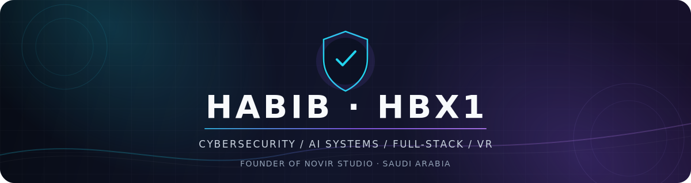

<div align="center">

<picture>
  <source media="(prefers-color-scheme: dark)" srcset="assets/profile-header.svg">
  <source media="(prefers-color-scheme: light)" srcset="assets/profile-header.svg">
  
</picture>

<br/>

<a href="https://git.io/typing-svg">
  
</a>

<br/>

[](https://github.com/hbx12?tab=followers)
[](https://github.com/hbx12)
[](https://github.com/hbx12)
[](https://github.com/hbx12?tab=repositories)

<br/>

**أبني أدوات حقيقية تحل مشاكل فعلية — من الفكرة إلى منتج يعمل.**

</div>

---

## `> whoami`

```typescript
const habib = {
  name: "Habib",
  alias: "HBX1",
  github: "@hbx12",
  location: "Saudi Arabia 🇸🇦",
  roles: [
    "Cybersecurity Student & Developer",
    "AI Systems Builder",
    "Full-Stack Developer",
    "Founder of NOVIR Studio"
  ],
  currentFocus: "Aura Work — secure, local-first AI agent infrastructure",
  building: [
    "Developer automation tools",
    "Discord × VRChat platforms",
    "Permission-gated AI agents",
    "Security-focused open-source software"
  ],
  principles: ["Security first", "Practical over flashy", "Ship real products"]
};
```

---

## `> featured_builds`

<div align="center">
  <a href="https://github.com/hbx12/aura-work">
    
  </a>
  <a href="https://github.com/hbx12/novirlink-vrchat">
    
  </a>
</div>

<table>
  <tr>
    <td width="50%" valign="top">
      <h3>🧠 Aura Work</h3>
      <p>Open-source, multi-provider desktop AI agent platform. Local-first, permission-gated and designed around secure developer workflows.</p>
      <p>
        <a href="https://github.com/hbx12/aura-work"></a>
        <a href="https://aura-work.shop"></a>
      </p>
    </td>
    <td width="50%" valign="top">
      <h3>🔗 NovirLink</h3>
      <p>A Discord × VRChat management platform for allowlists, moderation, appeals, dashboards and Udon-powered world integrations.</p>
      <p>
        <a href="https://github.com/hbx12/novirlink-vrchat"></a>
        <a href="https://novirlink.shop"></a>
      </p>
    </td>
  </tr>
</table>

### Other public work

- **[OpenCode Telegram Bot](https://github.com/hbx12/opencode-telegram-bot)** — open-source work around remote AI coding workflows, reliability and developer experience.
- **[OpenCode](https://github.com/hbx12/opencode)** — public development workspace for upstream experiments and contributions.
- **[OpenWork](https://github.com/hbx12/openwork)** — public workspace exploring agent-powered developer tooling.

---

## `> tech_arsenal`

<div align="center">

### Languages & application development


### Web, desktop & backend


### Platforms & tools


<br/>


</div>

---

## `> github_analytics`

<div align="center">
  
  
</div>

<br/>

<div align="center">
  
</div>

<br/>

<div align="center">
  
</div>

---

## `> contribution_snake`

<div align="center">
  <picture>
    <source media="(prefers-color-scheme: dark)" srcset="https://raw.githubusercontent.com/hbx12/hbx12/output/github-snake-dark.svg" />
    <source media="(prefers-color-scheme: light)" srcset="https://raw.githubusercontent.com/hbx12/hbx12/output/github-snake.svg" />
    
  </picture>
</div>

---

## `> find_me_online`

<div align="center">

[](https://github.com/hbx12)
[](https://aura-work.shop)
[](https://novirlink.shop)
[](https://novirlink-mini.shop)

<br/><br/>

<picture>
  <source media="(prefers-color-scheme: dark)" srcset="assets/profile-footer.svg">
  <source media="(prefers-color-scheme: light)" srcset="assets/profile-footer.svg">
  
</picture>

</div>
